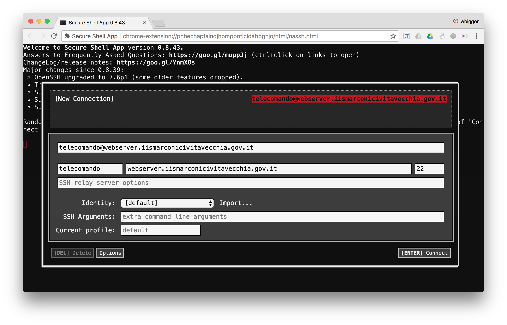

# Come connettersi via SSH alla Raspberry della scuola

Per potervi esercitare anche a casa, la scuola ha predisposto una Raspberry con accesso dall'esterno. La Raspberry sarà online fino alla data della verifica di laboratorio, a seguito della quale verrà sconnessa per motivi di sicurezza. In caso di problemi, scrivete a claudio.capobianco@istruzione.it.

La password è "proiettore". __Non__ divulgate la password, grazie!

## Chrome Secure Shell App
Il modo più semplice per collegarsi è attraverso l'estensione "Secure Shell" di Chrome. Per installarla:
- aprite Google Chrome
- installate l'estensione da questo link: [https://chrome.google.com/webstore/detail/secure-shell-app/pnhechapfaindjhompbnflcldabbghjo](https://chrome.google.com/webstore/detail/secure-shell-app/pnhechapfaindjhompbnflcldabbghjo)

Una volta installata, dallo stesso link qui sopra potete lanciare l'estensione.

Nel campo "username@hostname or free form text" dovete inserire la seguente stringa: "telecomando@webserver.iismarconicivitavecchia.gov.it"; quindi cliccate sugli altri campi in grigetto sotto per confermare, se necessario.

Il risultato finale deve essere così:
<p align="center">

</p>

A questo punto cliccate su "[ENTER] Connect" per connettervi.

## Windows: PuTTY
Un'alternativa solo per Windows è PuTTY. Potete scaricare l'applicazione da qui: [https://www.putty.org/](https://www.putty.org/).

Selezionate "Session", connection type "SSH", in hostname inserite `telecomando@webserver.iismarconicivitavecchia.gov.it`. Lasciate la porta di default (22), cliccate su "Open".

## Mac: ssh nativo
I computer Apple hanno il comando `ssh` nativo. Aprite l'applicazione Terminal; se non la trovate, cercate tra le "Utilities" o in "Other".

> Un ottima alternativa al Terminale di default del Mac è [iTerm2](https://www.iterm2.com/). Caldamente consigliato.

Dal terminale, digitate:
```
ssh telecomando@webserver.iismarconicivitavecchia.gov.it
```

## Android: JuiceSSH
È possibile accedere anche da Android, installando un client SSH. Il più comune è JuiceSSH: https://play.google.com/store/apps/details?id=com.sonelli.juicessh&hl=it.

Dopo aver installato l'applicazione, apritela, andate su Connections, premete sul tasto +, come "Address" inserite "webserver.iismarconicivitavecchia.gov.it", create una nuova identità con username "telecomando". Cliccate sulla V in alto a destra per confermare, quindi cliccate sulla connessione appena creata e seguite le istruzioni.

## iPhone: Termius
Questa è l'unico client che non ho provato, ma non dovrebbero esserci particolari problemi.

Esistono diversi client SSH per iPhone, ma dopo un po' di ricerca, sembra che la soluzione migliore gratuita sia Termius: https://itunes.apple.com/us/app/termius/id549039908?mt=8.

Non so la procedura esatta da seguire, ma in generale è molto semplice fare una connessione SSH, basta sapere che la username è "telecomando", l'hostname è "webserver.iismarconicivitavecchia.gov.it", la porta è quella di default (22).
