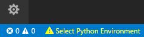

# Come usare Python

## Usare Python sul server della scuola
Per gli studenti del Marconi, è possibile esercitarsi con Python senza installare nulla collegandosi direttamente al server della scuola.

Collegatevi via SSH o con l'estensione Remote SSH al server ed usate il comando `python3` per eseguire il vostro codice Python.

## Usare Python con Visual Studio Code sul proprio computer

### 1. Installare Python
Per installare Python su Visual Studio Code, [questa](https://code.visualstudio.com/docs/python/python-tutorial) è la guida ufficiale. Riepiloghiamo in breve qui i passaggi.

Andare sul sito [Python downloads](https://www.python.org/downloads/) e scaricare l'ultima versione di Python premendo il bottoncione giallo grande con scritto "Download Python".

Quando lo avviate, vedrete una schermata di questo genere (la versione di Python potrebbe cambiare):

Attenzione: selezionate l'ultima spunta in basso "Add Python to PATH" per poter usare i comandi Python anche da terminale.

Seguite le istruzioni fino in fondo, e se necessario riavviate Visual Studio Code.

### 2. Installare l'estensione per Visual Studio Code
Aprite Visual Studio Code ed installate l'estensione [Python di Microsoft](https://marketplace.visualstudio.com/items?itemName=ms-python.python). 

Una volta installata, quando aprirete un file con estensione `.py` vi comparirà nella barra blu in basso la possibilità di selezionare l'interprete Python. Selezionate l'ultima versione che avete appena installato.

