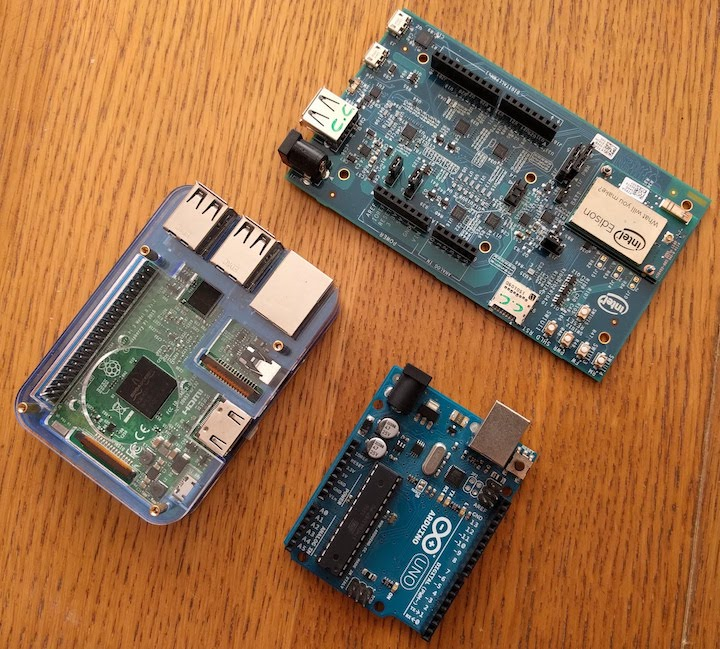

# MCU vs CPU

Prima di cominciare, cerchiamo di capire il contesto in cui ci troviamo.

## Tutti i computer hanno un sistema operativo?

Short answer: no 🙂

Long answer:

Il sistema operativo gestisce le risorse della macchina (memoria, processore, periferiche) per permettere a più applicazioni di poter funzionare contemporaneamente. Ma ogni cosa ha un suo costo: il sistema operativo, come ben sappiamo, utilizza per sé stesso una porzione a volte considerevole delle riorse stesse del nostro computer: pensiamo a quanti GB sul disco occupa una installazione di Windows o Mac, a quanta memoria occupa, e che ha volte i loro processi impegnano la CPU senza una ragione apparente. Oltre a questo pensiamo a problemi di vulnerabilità, aggiornamento, etc.

Se noi vogliamo far girare un solo programma sul computer, possiamo non aver bisogno di un sistema operativo. Tipicamente quest accade per piccoli elaboratori per compiti molto specifici: questo sistemi vengono chiamati _embedded_.

## Qualche esempio di computer con e senza OS?

In generale, tutti i computer con una interfaccia grafica sono progettati per fare più cose contemporaneamente, ed hanno un sistema operativo: pensiamo ad esempio ai nostri computer desktop, laptop, smartphone. Anche i web server sparsi per il mondo fanno tante cose insieme, ed hanno un sistema operativo.

Le cose diventano un po' più complicate quando parliamo di piccoli computer su una sola scheda, chiamati appunti _single-board computer_. In classe abbiamo visto diversi tipi di queste schede:

A sinistra c'è una Raspberry PI 3 (con il case), a destra in alto un Intel Galileo, sotto un Arduino. Le prime due hanno un sistema operativo, la terza no.

## E' possibile distinguere visivamente se un computer ha un OS?

Di solito sì, perché l'architettura e la disposizione dei componenti sulla scheda è diversa.

Per i computer senza OS, i componenti base di un elaboratore sono su un unico chip, che viene chiamato _microcontollore_, abbreviato in **MCU** (Microcontroller Unit):  unità di elaborazione (processore), memoria volatile (RAM) e memoria a lungo termine. Nella foto di Arduino, è quel chip rettangolare lungo con tanti piedini su due lati.

Per i computer con OS, i componenti solitamente sono su chip separati. Il chip dedicato all'elaborazione viene chiamato _microprocessore_, abbreviato in **CPU** (Central Processing Unit). Come dice il nome, la CPU è specifica per il processamento dei dati ed è "centrale", rispetto agli altri componenti collegati ad esso. Nella Raspberry nella foto, la CPU è quella sotto il foro circolare. La RAM è nella parte inferiore della scheda e la memoria a lungo termine è nella scheda microSD estraibile.

## Il sistema operativo è legato al tipo di CPU?

Come per ogni domanda in questo ambito così complesso, la risposta comincia con...dipende!

Il sistema operativo è un programma estremamente complesso, e si può dividere in diverse componenti. Solo quelli più vicini all'hardware dipendono dalla CPU, dal tipo di RAM e da tutti i componenti e le periferiche.
