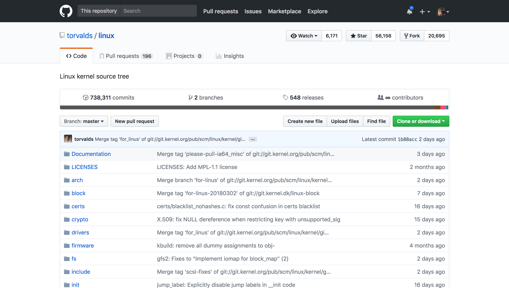
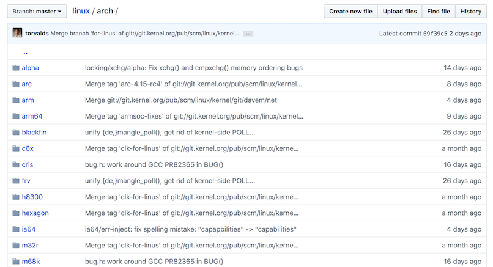

# Kernel

Abbiamo visto che il sistema operativo può essere diviso in varie componenti, che possono essere raggruppati in base alla dipendenza dall'hardware su cui girano: a questo fine si usa la metafora delle sfere concentriche, in cui al centro di tutto c'è l'hardware.

Il programma che è più vicino all'hardware viene chiamato **kernel**. Sulla Raspberry Pi, viene utilizzato un kernel chiamato **Linux**.

> Il kernel Linux è stato creato nel 1991 da Linus Torvalds, ed è distribuito attraverso la licenza di software libero GNU GPLv2, ideata da Richard Stallman per proteggere il software libero (free software, con "free as in speech").

## Funzioni principali del kernel

Come abbiamo visto, il kernel si occupa di mediare l'accesso delle applicazioni alle risorse del computer:
 - central processing unit (CPU)
 - memoria volatile (RAM)
 - periferiche di input/output (hard disk, tastiera, mouse, stampanti, etc.)

Questa mediazione dell'accesso avviene attraverso alcune funzionalità chiave:
- lo _scheduling_, che decide quale _processo_ deve essere eseguito in un determinato istante, in accordo ad alcuni criteri
- la gestione della _memoria_, per permettere alle applicazioni di avere lo spazio di memoria richiesto, senza che diverse applicazioni interferiscano tra di loro e senza che possano creare danni più o meno voluti.

## Il kernel è un programma

Il kernel è un programma come gli altri, non ha niente di "magico". Del kernel Linux possiamo anche vederne il codice sorgente, visto che è software libero e quindi anche aperto.

> Il software libero ([free software](https://www.gnu.org/philosophy/free-sw.it.html)) implica che il codice sia anche aperto ([open-source](https://opensource.org/about)), perché la possibilità di visionare il codice è una delle libertà fondamentali. **Non è vero il viceversa**: un codice aperto potrebbe non essere libero. Controllare sempre la licenza per sapere quali sono i termini esatti di utilizzo.

> Non confondere "free software" con "freeware". Il freeware è semplicemente del software che non paghi direttamente per poterlo usare, ma non implica nessun'altro concetto o filosofia. Il free software è generalmente gratis, ma non sempre.

Possiamo trovare il codice sorgente di Linux sulla piattaforma GitHub, a questo indirizzo: [https://github.com/torvalds/linux](https://github.com/torvalds/linux)

> Il codice sorgente su git/GitHun viene contenuto in _repository_.

Navigando all'interno di questo repository ci aspettiamo di trovare varie cose relative ai diversi tipi di hardware in commercio. Ed è effettivamente così: per esempio, se navighiamo nella cartella `arch/`, possiamo trovare una lista di tutte le varie [architetture di CPU](https://en.wikipedia.org/wiki/List_of_CPU_architectures) in commercio.

Navigando tra i file del kernel vi accorgete che sono tutte istruzioni a basso livello. Per poter usare in maniera comoda queste istruzioni, ci serve un altro strato sopra il kernel, che vedremo nella prossima pagina.
