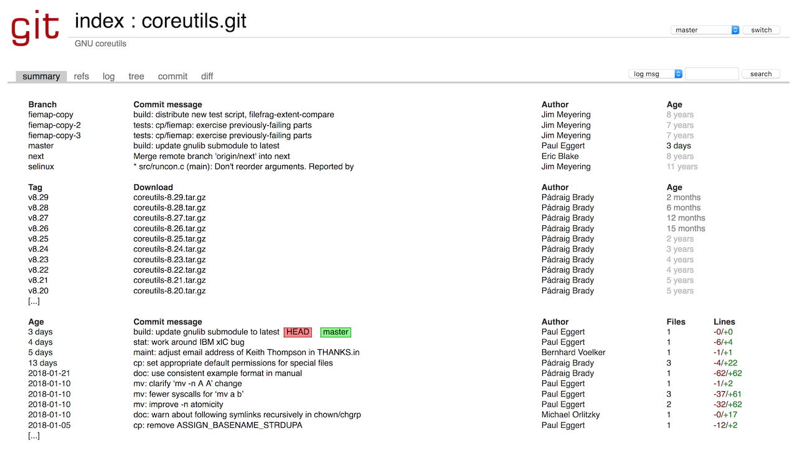

# GNU Utils

Per poter usare in maniera le chiamate di sistema che ci mette a disposizione il kernel, ci sono una serie di strumenti che ci facilitano i compito. Per Linux, queste utiità sono state sviluppate dal [progetto GNU](www.gnu.org), e si chiamano **GNU coreutils**.

> Il progetto GNU è stato fondato nel 1983 da Richard Stallman, al MIT di Boston. GNU ha lo scopo in primo luogo di permettere agli sviluppatori di tutto il mondo di poter sviluppare _liberamente_ software, ovvero avendo a disposizione il codice sorgente dei programmi di altre aziende che usano, e senza la necessità di pagare licenze. Le utilità che useremo in questo corso sono solo parte del progetto; un'altra parte fondamentale è la licenza che permette al software di essere usato legalmente, rispettando le libertà fondamentali del free software. Il nome di questa licenza è GPL (General Public Licence), di cui l'ultima versione è la [GPLv3](https://www.gnu.org/licenses/gpl.html) <p align="center"><a href='https://www.gnu.org/licenses/gpl.html'></a></p>

Anche in questo caso possiamo andare a cercare il [codice sorgente](http://git.savannah.gnu.org/cgit/coreutils.git) delle coreutils.

<p align="center">

</p>

Andando a vedere il codice sorgente nella tab "tree", ed entrando nella cartella `src`, potete trovare il codice sorgente di tutti i comandi che ci sono familiari e su cui avete fatto la ricerca.

<p align="center">

</p>


## Extra: ricompilare le GNU coreutils
Questo non fa strettamente parte di questa unità didattica, ma ve la lascio in caso qualcuno di voi voglia fare degli esperimenti.

Se volete modificare le GNU coreutils, ad esempio per cambiare il funzionamento di `ls` o `yes`, potete farlo seguendo le istruzioni qui sotto.

1. accedere al terminale della vostra Raspberry
1. abilitare il download dei sorgenti da /etc/apt/sources.list, togliendo il commento all'ultima riga
1. creare ed entrare in una cartella separata
```
 mkdir coreutils-src
 cd coreutils-src
```
1. scaricare i sorgenti e scompattarli
```
apt-get source coreutils
tar xvf coreutils_*.orig.tar.xz
```
1. entrare dentro la cartella `src`, all'interno possiamo vedere i sorgenti dei vari comandi.
```
cd src
```

### Modificare un comando
Possiamo provare a modificare il comando `yes`, che è uno dei più semplici. Modificare l'eseguibile in modo che invece di `yes`, stampi quello che volete.

1. modificare il file `yes.c`
2. tornare alla root del progetto e ricompilare
```
cd ..
./configure.sh
make
```

Ora nella cartella `src` avete tutti gli eseguibili! Provate a lanciare yes e vedete se stampa quello che desiderate.
```
cd src
./yes
```
