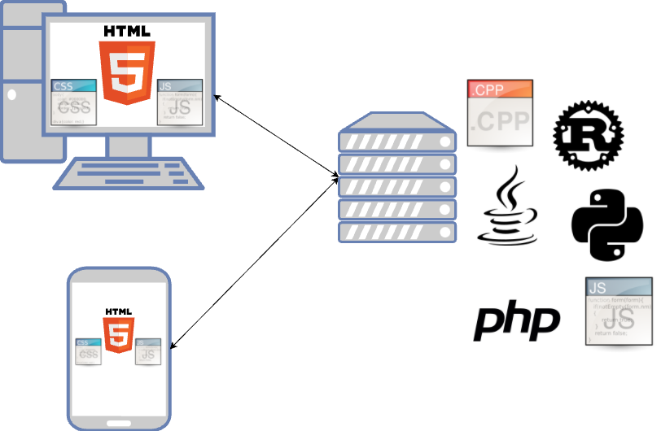

# Introduzione

## Cos'è una web app?

Finora abbiamo sviluppato un'applicazione che gira su una singola macchina. Questo ci pone però dei limiti: se volessimo giocare con un'altro giocatore in rete? Se volessimo salvare i nostri progressi e poi usare un altro dispositivo?

Per questi ed altri motivi negli ultimi anni si sono largamente diffuse le _web application_, cioè applicazione che vengono eseguite in parte sul browser della mia macchina ed in parte su una macchina server in rete.

> Le _web application_ sono un caso particolare di applicazioni _distribuite_, cioè applicazioni che girano su più macchine fisiche. Le web app nello specifico hanno un architettura _client_ (il mio browser) - _server_ (la macchina in rete) ed usano i protocolli e gli standard tipici del web (HTTP, REST-API, web sockets, JSON, etc.)




Per il lato client, la tecnologia è obbligata: i browser supportano solo HTML5, che è uno standard che utilizza HTML, CSS e JavaScript.

Per il lato server invece possiamo usare il linguaggio che preferiamo. I più usati sono :
- [PHP](https://www.php.net/)
- [Python](https://www.python.org/)
- [Java](https://www.java.com/it/)
- C++ (non esiste un sito ufficiale, potete guardare [questo](http://cplusplus.com/))
- [Rust](https://www.rust-lang.org/it) (I ❤️ Rust)
- [Go](https://go.dev/) (linguaggio di Google)
- [Scala](https://www.scala-lang.org/) (linguaggio simile a Java ma più orientato alla programmazione _funzionale_ e più bello)
- [Erlang](https://www.erlang.org/) (linguaggio per la programmazione funzionale)
- [Ruby](https://www.ruby-lang.org/it/)
- [Haskell](https://www.haskell.org/) (linguaggio dichiarativo, ostico ma bello)

Noi useremo Python per la parte server.

## Python & Flask
Per poter comunicare con il mondo esterno, la nostra applicazione in Python deve avere un componente che glielo permetta. In particolare questo componente dovrà:
- accettare le richieste dall'esterno e inoltrarle (_route_) alla nostra applicazione
- permettere alla nostra applicazione di rispondere alle richieste.

Questo componente si chiama _framework web_, ne esistono diversi per ogni linguaggio di programmazione e nel nostro caso useremo [__Flask__](https://flask.palletsprojects.com/en/2.0.x/).

### Come usare Flask
#### Sul vostro computer
Nella vostra macchina di casa, per installare Flask basta aprire un terminale e lanciare il comando:

```sh
pip3 install flask
```

Per lanciare l'applicazione, basta scrivere:

```sh
flask run
```

Attenzione: per motivi di sicurezza l'applicazione di default è raggiungibile solo in locale attraverso l'interfaccia di loopback (127.0.0.1) e non da altri computer connessi in rete.

#### Sul server della scuola
La scuola mette a disposizione Flask per ogni utente della scuola. Per poterlo usare, basta creare una cartella che si chiami esattamente "flask" e usare quella per il progetto.

```sh
# sul server della scuola
cd ~
mkdir flask
cd flask
```

Il file che contiene flask deve avere il nome standard `app.py`.

In questo caso, non è necessario lanciare flask, perché il web server che gestisce tutta la macchina (nel nostro caso Apache) è già configurato per lanciare flask quando si accede a quella cartella.

## Primi passi con Flask
Ora creiamo il file principale del nostro progetto, che chiamiamo esattamente `app.py`. Attenzione: il nome deve essere questo, altrimenti non funziona tutto automagicamente 🎩.

Nel nostro nuovo file, per prima cosa importiamo Flask:

```py
from flask import Flask
```

Quindi creiamo un'istanza del framework. In Python, per creare l'istanza si una classe basta mettere il nome della classe (senza `new`) ed i parametri per l'inizializzazione. Nel caso di Flask, l'unico parametro obbligatorio è un nome scelto a piacere che ci servirà per riconoscere il nostro programma tra gli altri che girano sul server.

```py
app = Flask("tris")
```

Ora creiamo una funzione che verrà richiamata quando accederemo alla radice del nostro sito. Per fare questo, dobbiamo usare l'annotazione `@app.route()` specificando come parametro il percorso che si deve gestire, nel nostro caso la radice `\\`; dopo l'annotazione la funzione che verrà chiamata e il cui valore di ritorno verrà restituito al browser.

```py
@app.route("/")
def tris():
    return "<h1>Gioco del tris!!</h1>"
```

Proviamo ad accedere alla nostra applicazione, o dal link locale (se lo lanciate dalla vostra macchina) o dal link della scuola. Il risultato dovrebbe essere come segue.

<h1>Gioco del tris!!</h1>


<!-- Attenzione: se book **non** fosse un tipo base ma un oggetto, questa sintassi non va bene, perché Python non saprebbe come convertire automaticamente un oggetto ti tipo `Book` in una stringa JSON. Per risolvere il problema, possiamo dire a Python che per trasformare l'oggetto in JSON deve associare ad ogni proprietà della classe Book una corrispondente proprietà nella stringa JSON. Per fare questo possiamo usare la proprietà `__dict__`, che come potete intuire dal doppio trattino basso all'inizio e alla fine, è una proprietà di sistema, assegnata automaticamente a tutti gli oggetti di una classe. La funzione precedente diventerebbe quindi:

```py
def data_book():
    return json.dumps(
        [book.__dict__ for book in catalogue]
        )
```


### Il formato JSON
Fate attenzione: [JSON](https://www.json.org/) è un formato per scambiarsi i dati tra macchine (machine-to-machine), ma che può essere letto e scritto abbastanza facilmente anche dagli esseri umani. JSON quindi non è un codice, o un'applicazione, o una libreria, ma è un formato di stringa che permette alle macchine di comunicare fra loro in modo comprensibile. Volendo fare un paragone con la lingua umana, è come la sintassi della frase: per capirsi le persone devono mettere nel corretto ordine soggetto, verbo e complementi, altrimenti non ci si capisce.

JSON usa le seguenti convenzioni:
- le parentesi graffe per definire gli oggetti
- le parentesi quadre per le liste
- la virgola per separare gli elementi di una lista
- i due punti per definire le proprietà di un oggetto

Ad esempio, per definire una lista di due oggetti, ognuno con le proprietà `title` e `author`, scriveremo:
```json
[
    {
        "title":"Harry Potter e il calice di fuoco",
        "author":"J.K.Rowling"
    },
    {
        "title":"Il rosso e il nero",
        "author":"Stendhal"
    },
    {
        "title":"Il piccolo principe",
        "author":"Antoine de Saint-Exupéry"
    }
]
```
Per generare o validare stringhe JSON, è possibile usare servizi online come ad esempio [JSON lint](https://jsonlint.com/?json=[{%22title%22:%22Harry%20Potter%20e%20il%20calice%20di%20fuoco%22,%22author%22:%22J.K.Rowling%22},{%22title%22:%22Il%20rosso%20e%20il%20nero%22,%22author%22:%22Stendhal%22},{%22title%22:%22Il%20piccolo%20principe%22,%22author%22:%22Antoine%20de%20Saint-Exup%C3%A9ry%22}]).

### Lanciare il web server
Per lanciare il web server, aprite un terminale nella cartella del vostro progetto e scrivete:

```
python3 -m flask run
```
Se tutto va bene, vi dovrebbe comparire la scritta `Running on http://127.0.0.1:5000/`. Ecco quindi il link che ci serviva per far comunicare la pagina web con la nostra applicazione!

## HTML
Ora creiamo un nuovo file, sempre nel nostro progetto, che chiamiamo `index.html`.

```hmtl
<!DOCTYPE html>
<html lang="it">
<head>
    <meta charset="UTF-8">
    <meta name="viewport" content="width=device-width, initial-scale=1.0">
    <meta http-equiv="X-UA-Compatible" content="ie=edge">
    <title>Biblioteca scolastica</title>
</head>
<body>
    <ul>
    </ul>    
</body>
</html>
```

È una semplice pagina che visualizza una lista, in questo momento vuota.

Come facciamo a riempire la lista con i dati presi dal web server? Ci serve un po' di JavaScript.


### JavaScript
Subito dopo il tag `</body>` e subito prima del tag `</html>`, nella penultima riga insomma, aggiungiamo il codice che ci serve. 

Prima di tutto scarichiamo ed importiamo una libreria JavaScript che ci semplificherà molto la vita e chi si chiama [JQuery](https://jquery.com). Potete scaricare il file direttamente cliccando con il tasto destro [qui](https://code.jquery.com/jquery-3.4.1.min.js) e scegliendo "Salva link come" o qualcosa di simile. Salvate il file sempre nella cartella di progetto.

Quindi aggiungiamo la seguente riga:
```html
<script src="jquery-3.4.1.min.js"></script>
```

OK, abbiamo importato la libreria. Ora dobbiamo prendere i dati dal web server. Lo facciamo scrivendo subito dopo un nostro pezzo di codice all'interno del tag `<script>`.

```html
<script>
    // Prende i dati come JSON dall'URL
    // quando ha finito di prendere i dati, chiama la funzione "makeList"
    $.getJSON("http://127.0.0.1:5000/").done(makeList);
</script>
```

Attenzione a quello che succede. Il codice dentro il tag script è JavaScript. Il simbolo del dollaro (`$`) indica che stiamo usando la libreria JQuery che abbiamo importato subito prima. Quando i dati sono stati completamente ricevuti (ci potrebbe volere del tempo, se i libri fossero molti), viene chiamata la funzione `makeList`, che dobbiamo ancora definire.

Subito dopo la riga precedente, creiamo ora la funzione `makeList`:
```js
function makeList(jsonBooks) {
    for (book of jsonBooks) {
        let newItem = `<li>${book}</li>`;
        $("ul").append(newItem);
    }
}
```

Vediamo cosa abbiamo fatto. Nella prima riga abbiamo creato una funzione con la keyword `function`; la funzione prende in input un parametro che gli viene passato da JQuery quando i dati sono stati ricevuti.

Subito dopo c'è un ciclo `for`, molto simile a quello del Python, con qualche differenza:
- JavaScript usa le parentesi dopo la keyword `for`
- JavaScript usa la keyword `of` invece che `in` per iterare all'interno di una lista
- JavaScript usa le parentesi graffe per contenere il corpo del `for`


All'interno del `for`, nella prima riga creiamo il nuovo item che vogliamo andare ad aggiungere alla lista.

Nella riga successiva, c'è un istruzione che dice:
- usando JQuery (`$`), seleziona la lista non ordinata (`ul`)
- all'interno della lista, aggiungi alla fine (`append`) il nuovo elemento appena creato

Il codice finale di tutta la pagina verrà come segue:
```hmtl
<!DOCTYPE html>
<html lang="it">
<head>
    <meta charset="UTF-8">
    <meta name="viewport" content="width=device-width, initial-scale=1.0">
    <meta http-equiv="X-UA-Compatible" content="ie=edge">
    <title>Biblioteca scolastica</title>
</head>
<body>
    <ul>
    </ul>    
</body>
<script src="jquery-3.4.1.min.js"></script>
<script>
    // Prende i dati come JSON dall'URL
    // quando ha finito di prendere i dati, chiama la funzione "makeList"
    $.getJSON("http://127.0.0.1:5000/").done(makeList);
    function makeList(jsonBooks) {
    for (book of jsonBooks) {
        let newItem = `<li>${book}</li>`;
        $("ul").append(newItem);
    }
}
</script>
</html>
```

### Go Live
Su Visual Studio Code (detto anche VSCode per brevità), potete lanciare questa pagina con "Go Live" nella barra in basso, lo trovate sulla destra. Se non lo vedete, assicuratevi di aver installato l'estensione "Live Server" su VSCode.

Al primo lancio vedrete che non succede niente. Per controllare cosa è successo, aprite la console di debug premendo con il tasto destro in qualsiasi punto della pagina web nel browser e cliccando su "Analizza elemento" o "Ispeziona elemento", quindi nel pannello che si apre, selezionate la tab console.

Se avete fatto tutto correttamente, dovrebbe comparirvi un messaggio di errore del tipo:
```
Cross-Origin Request Blocked: The Same Origin Policy disallows reading the remote resource at http://127.0.0.1:5000/. (Reason: CORS header ‘Access-Control-Allow-Origin’ missing).
```

È normale, perché state usando due web-server diversi per la stessa pagina, questa è una cosa potenzialmente pericolosa ed il browser vi impedisce di farlo. Per aggirare la limitazione, il modo più semplice è installare queste estensioni per [Firefox](https://addons.mozilla.org/it/firefox/addon/cors-everywhere/) o per [Chrome](https://chrome.google.com/webstore/detail/allow-cors-access-control/lhobafahddgcelffkeicbaginigeejlf). In questo modo vi caricherà la pagina correttamente anche in questo caso.

> Ovviamente non è questo il modo più corretto di procedere. Per fare le cose per bene, bisogna spostare tutto su Flask, anche le pagine HTML. È un'operazione abbastanza semplice ma la vedremo dopo che vi sarete impratichiti con questa parte. -->
