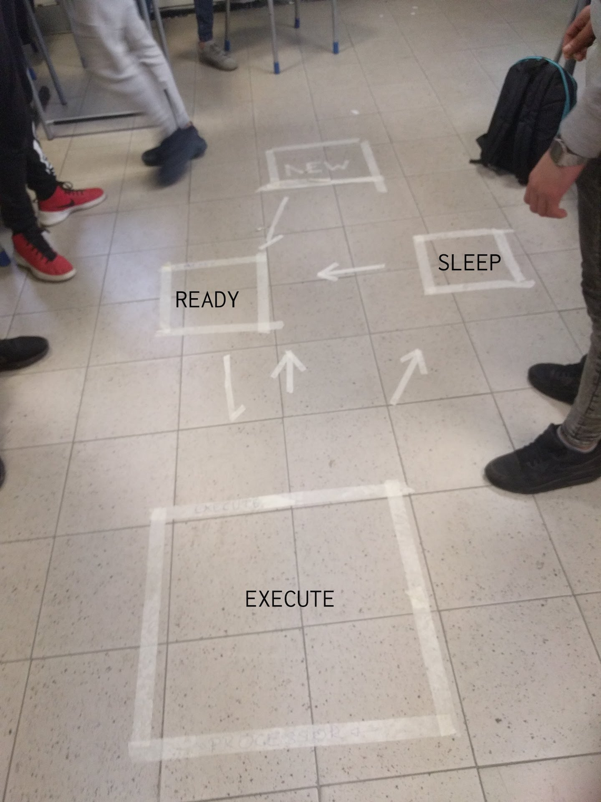
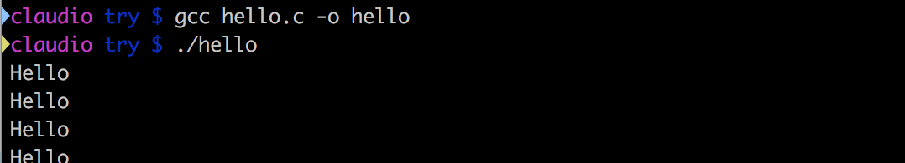
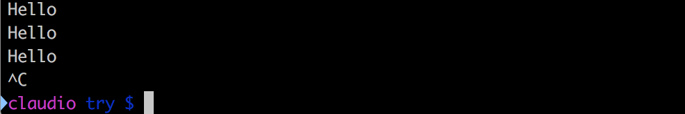
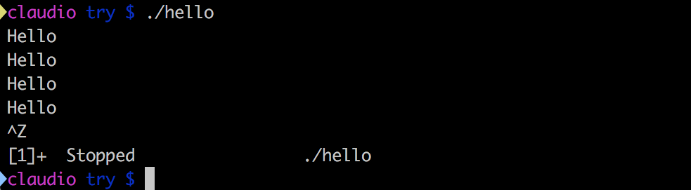
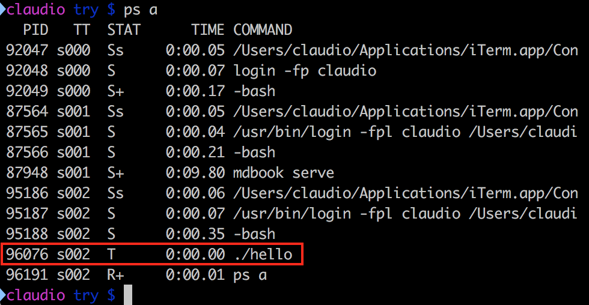
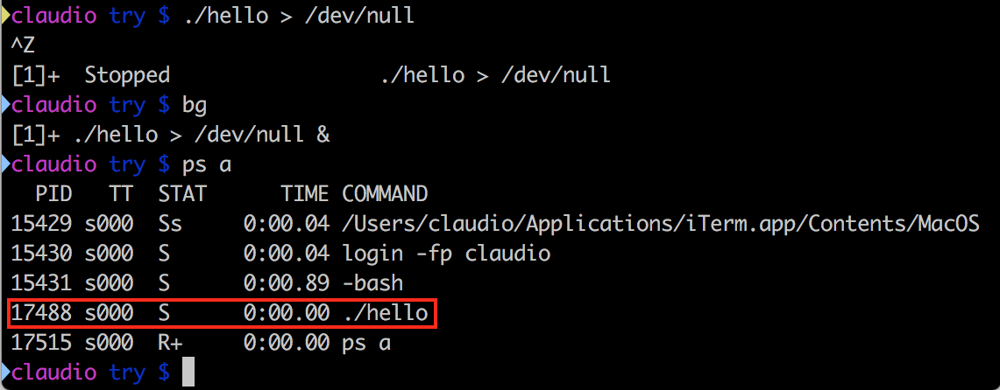

# Scheduler

Uno dei compiti principali del sistema operativo, ed in particolare del kernel, è quello di decidere quando una determinata applicazione può usare il processore. Questo meccanismo viene chiamato **scheduling**.

L'unità fondamentale su cui lavora lo scheduling per gestire il processore viene chiamato, senza sorprese, _processo_.

## Processi
Noi scriviamo del codice sorgente sul nostro editor di testo e lo salviamo in un file. Questo file viene chiamato _programma_. Il programma, per poter essere eseguito, deve essere compilato e caricato in memoria. Una volta che queste operazioni sono state fatte, il programma diventa a tutti gli effetti un _processo_. Possiamo quindi dire che _i processi sono programmi in esecuzione_. Un programma può essere eseguito più volte ed avere quindi più processi in esecuzione: pensiamo ad esempio a diverse finestre di un browser.

### Ciclo di vita dei processi
Quando il programma viene eseguito, _nasce_ un processo e questi ha un suo _ciclo di vita_ che viene gestito dallo scheduler. Il ciclo di vita è rappresentato da diversi stati.

<p align="center">

</p>


Al processo appena creato lo scheduler assegna lo stato `NEW`, durante il quale il programma alloca tutte le risorse di cui necessita (es. memoria). Quando ha finito, lo scheduler gli assegna lo stato `READY`: i processi contrassegnati con questo stato sono pronti ed in "fila" per essere eseguiti sul processore. Quando questo accade lo stato cambia in `EXECUTE`.

Nello stato `EXECUTE` possono succedere diverse cose:
 - il processo richiede una risorsa che non è disponibile, in questo caso lo scheduler gli assegna lo stato `SLEEP` (aka `waiting`)
 - lo scheduler decide di assegnare il processore ad un altro processo, e riporta il processo corrente in `READY`
 - il processo finisce le cose che doveva fare o viene "ucciso" (_killed_) dall'esterno, lo scheduler gli assegna lo stateo `TERMINATED` nel quale libera le risorse che ha allocato nel suo ciclo di vita
 - il processo viene "fermato" (_stopped_) dall'esterno, ed entra nello stato di `STOP`; lo stato di `STOP` è simile a `SLEEP` ma lo stop viene comandato dall'esterno.

> Libro, studiare: pag. 238, stato dei processi.

 Nella realtà, il kernel Linux prevede molti altri stati, che considerano se il processo sta eseguendo delle operazioni da amministratore o utente, o se il processo è nella memoria RAM o nella memoria di swap. A volte uno processo che ha finito tutte le operazioni può diventare `ZOMBIE` se ha ancora qualche legame con il mondo che non lo fanno morire serenamente. Il meccanismo base è comunque quello descritto sopra e ci concentreremo quindi su quello.

## Scriviamo il nostro programma
Per verificare quanto appena detto, scriviamo un semplice programma in C, che salveremo in un file chiamato `hello.c`.

Vogliamo che questo programma stampi su schermo una stringa una volta al secondo, finché non viene esplicitamente fermato dall'utente.


```
# include <stdio.h>; // libreria che contiene la funzione printf
# include <unistd.h> // libreria che contiene la funzione usleep

// la funzione main è l'entry point del programma, da dove comincerà l'esecuzione
int main {
  // questa forma del for equivale ad un ciclo infinito
  for (;;) {
    // stampa una stringa nello standard output, generalmente la console da cui viene lanciato il programma
    printf(“HELLO”);
    // aspetta per un certo numero di microsecondi
    usleep(1000000); // 1e6 microsecondi = 1 secondo
  }
  // il return fa uscire dalla funzione corrente, ma trovandoci nel main fa uscire dal programma.
  return 0;
}
```

La funzione int main richiede di ritornare un valore intero. Per convenzione dei programmi C, si ritorna 0 se non ci sono stati errori, un valore negativo altrimenti.

### Compilazione
Prima di poterlo eseguire, dobbiamo _compilare_ il programma, ovvero trasformarlo da un file leggibile dagli esseri umani, ad un file leggibile dalla macchina. Nei sistemi GNU Linux, questo compito è svolto dal programma `gcc`.

> GCC è l'acronimo di GNU Compiler Collection (originariamente GNU C Compiler), e contiene tutti gli strumenti per compilare programmi scritti in moltissimi linguaggi diversi. Come dice il nome, gcc è stato sviluppato da GNU ed è quindi software libero ([qui](https://gcc.gnu.org/viewcvs/gcc/) potete trovare il codice sorgente).

La compilazione di un programma C prevede due fasi:
1. trasformazione di un file di testo `.c` in un _oggetto_ `.o`
1. collegamento (_linking_) dell'oggetto con tutti gli altri oggetti delle librerie di cui ha bisogno

Entrambe queste operazioni possono essere svolte con il seguente comando.
```
gcc hello.c -o hello
```

Questo comando ha creato l'eseguibile `hello`. Ora eseguiamolo.
```
./hello
```
<p align="center">

</p>

Bene! Ricapitolando, abbiamo scritto un programma, l'abbiamo compilato, eseguito ed è diventato un processo. Ma come facciamo a fermarlo??

Fortunatamente, da terminale possiamo inviare _segnali_ al processo, usando degli shortcut da tastiera. Con `ctrl-c`, inviamo il segnale di `kill` al processo, e lo scheduler lo muove nello stato di `TERMINATED` e successivamente lo elmina dalla memoria. Proviamo.

<p align="center">

</p>

OK ma... così non posso esaminare il mio sistema quando il processo è in esecuzione. Fortunatamente, esiste un altro segnale che serve proprio a questo: `ctrl-z` invia un segnale al processo per sospenderlo, e lo scheduler gli assegna lo stato di `STOP`.

<p align="center">

</p>

Come vediamo dalla stampa su schermo, il processo è ancora in vita ed è stato fermato (`STOPPED`).

Per vedere in che stato si trovano i processi in questo momento, possiamo usare il comando `ps` con il parametro `a`

```
ps a
```
<p align="center">

</p>

Il nostro processo è in stato `T`. A cosa corrisponde? Consultiamo il manuale
di `ps` con il comando:
```
man ps
```
Scorrendo, vediamo ad un certo punto la lista degli stati e che T corrisponde a stopped, come ci aspettavamo.

Ora facciamo riprendere l'esecuzione al processo, con il comando:
```
bg
```
Il comando `bg` è l'abbreviazione di "background" e permette di far continuare l'esecuzione ad un processo, e contemporaneamente avere il controllo della shell. Se infatti provate ora ad eseguire un qualsiasi comando, la shell vi risponderà. Il problema è che l'output della shell viene continuamente interrotto dalle stampe, il che è molto fastidioso. Come fare?

Prima di tutto terminiamo il processo `./hello`. Per fare questo, dobbiamo riportarlo in foreground con il comando:
```
fg
```
che è l'abbreviazione di "foreground". A questo punto possiamo terminarlo normalmente con `ctrl-c`.

Ora possiamo _re-indirizzare_ l'output del nostro processo in un luogo diverso dalla console. Infatti, quando usiamo la printf nel nostro programma C, stiamo dicendo implicitamente di usare lo _standard output_ (abbreviato `stdout`), che di default è il terminale da cui abbiamo lanciato l'eseguibile.
```
printf --> stdout --> terminale
```
Questo comportamento può essere sovrascritto nel momento in cui si lancia l'eseguibile, con il carattere maggiore `>`. Si può reindirizzare l'output in un qualsiasi _file_, e questo in generale è utile ad esempio per fare dei log di sistema. Nel nostro caso, non siamo interessati a salvare in maniera persistente l'output del nostro programma, e ci viene in aiuto un file speciale dei sistemi Linux che si comporta da "buco nero", un pozzo senza fondo in cui possiamo metterci dentro qualsiasi cosa, l'output verrà semplicemente scartato. Questo file speciale è `/dev/null`. Lanciando il comando così modificato:
```
./hello > /dev/null
```
abbiamo che l'output ora non è più visibile sul nostro terminale. Riprendiamo il controllo della shell con `ctrl-z`, mettiamo il processo in background con `bg` e _voilà!_ abbiamo il nostro processo in esecuzione e il controllo della shell.

Controlliamo che il processo sia effettivamente lì, e vediamo in che stato si trova.
```
ps a
```
<p align="center">

</p>
Ora vediamo che lo stato del processo è cambiato, si trova in stato `S`, che corrisponde a _sleep_. Ma perché non si trova in running?!?

Ci sono diversi motivi. Il primo è che durante la `usleep` il processo è in stato di _sleep_ (ovviamente). Considerando che la stampa dell'output richiede pochi millisecondi, è effettivamente molto probabilmente che quando lanciamo `ps` troviamo il nostro processo dormiente.

> Se togliessimo la usleep? Il risultato dipenderebbe dal numero di _core_ che ha il processore: su ogni core può esserci un processo in esecuzione. Ma se avessimo un solo core, succederebbe che tutto il nostro sistema sarebbe estremamente rallentato, perché quasi sempre ci sarebbe `./hello` in esecuzione.

Come fa lo scheduler a decidere quale processo in ogni momento deve essere eseguito sul processore? Utilizza dei criteri, che costituiscono poi la parte più importante dello scheduler stesso.

## Criteri di scheduling

> Libro: studiare pag.241, "Criteri di scheduling"

Immaginate di avere un'attività commerciale con una sola cassa e tantissimi utenti in coda da gestire. In qualità di gestori, dovete dare chiare istruzioni all'operatore o operatrice alla cassa su come gestire i clienti.

Gli sviluppatori che programmano lo scheduler si trovano in una situazione molto simile. Inizialmente le cose sono facili: si potrebbe dire che si devono servire i clienti/processi uno alla volta in base all'ordine di arrivo, e li servo finché non hanno finito le loro richieste. Questo sistema si chiama _First-Come-First-Served_ ed è molto simile ad una coda FIFO (First-In-First-Out). Scrivere uno scheduler così è molto semplice, ma porta presto a ovvi problemi: se un processo ha tante cose da fare blocca il sistema.

Un'alternativa è quello di servire prima quelli che richiederanno meno tempo ad essere eseguiti. Questo approccio si chiama _Shortest Job First_. Anche questo è semplice ma porta all'eccesso opposto del precedente: è probabile che processi che richiedano tanto tempo di esecuzione non vengano mai completati.

Ora pensate ad un pronto soccorso. Immaginate che arrivi qualcuno in fin di vita che richieda un operazione importante, e davanti a lui ci sono molte persone con dei problemi lievi. Cosa fareste? Ovviamente dareste priorità al ferito grave. Ed è questo effettivamente un altro concetto chiave che si può aggiungere allo scheduler: la _priorità_. Alcuni processi è bene eseguirli prima di altri. In generale, i processi relativi _all'interazione utente_ (es. interfaccia grafica) hanno alta priorità, perché in questi casi anche un ritardo di pochi millisecondi può essere molto fastidioso e portare all'inutilizzabilità di tutto il sistema.

Nella realtà, si usa una combinazione di tutte le soluzioni sopra, e non ce n'è una adatta a tutte le situazioni. Come scegliere, allora?

Come sempre, le scelte vanno prese in base a dei _valori_ (aka _principi_ o _obiettivi_), e basati su dei parametri misurabili.

<p align="center">
<b>No valori</b> --> <b>No scelte sensate</b><br>
<b>No misure</b> --> <b>No sonni tranquilli</b>
</p>

I valori che potete porre alla base delle vostre scelte possono essere, ad esempio:
- equità
- bilanciamento
- controllo

> Studiare pag. 242 del libro relativamente a questi concetti

### Round Robin
Un caso semplice ma efficace di scheduling si chiama _Round Robin_ ed è molto utilizzato nei casi in cui la semplicità ed il determinismo sono particolarmente importanti, come ad esempio nei sistemi _Safety Critical_, ovvero per sistemi in cui un malfunzionamento può portare a danni alle persone (safety).

> Per approfondire, vedi pag. 246 del libro.


## Are you pre-emptive?
Come ultima cosa, è importante comprendere bene il concetto di _pre-emptive_.

Immaginate di essere l'operatore o operatrice al bancone di una pizzeria al taglio. Mentre state servendo un cliente, entra il sindaco della vostra città ed ha evidentemente molta fretta di essere servito. In accordo con i criteri che vi sono stati dati, assegnate un'alta priorità al sindaco, ma cosa fate con il cliente attuale?

Avete due possibilità:
- _non pre-emptive_: finite di servire il cliente attuale, e poi servite il sindaco
- _pre-emptive_: servite immediatamente il sindaco, mettendo da parte il cliente attuale

Quale scegliere? Ovviamente dipende dal vostro contesto d'uso e dai vostri valori e obiettivi. Non c'è una soluzione migliore in assoluto, ed ogni scelta ha dei vantaggi e degli svantaggi.
