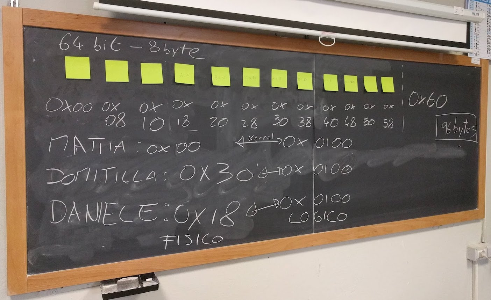
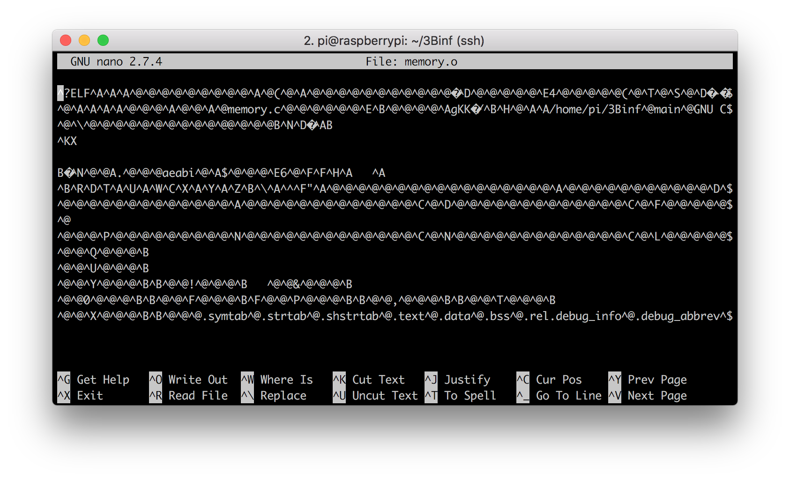
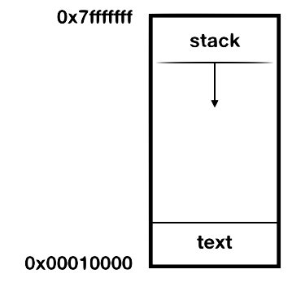

# Gestione della memoria

Come abbiamo detto, un elaboratore elettronico è composto fondamentalmente da due entità: un unità di processamento, e delle informazioni da processare.  Queste informazioni si trovano in un elemento chiamato _memoria_. È chiaro quindi perché la gestione della memoria è un aspetto fondamentale di un sistema operativo.

La memoria serve principalmente a due scopi:
- ospitare il binario del processo, con le istruzione per il processore
- ospitare i dati che vengono manipolati dal processo durante la sua esecuzione

## Caricare un processo in memoria
La memoria su cui opera il _processore_ è detta _memoria centrale_, che corrisponde quasi sempre la memoria _RAM_. La memoria centrale può essere vista come un lunghissimo array di byte, a cui si può accedere liberamente semplicemente sapendo la sua posizione nell'array.

> Altri tipi di memoria, come per esempio l'hard-disk, non possono essere visti come una semplice sequenza di byte a cui accedere.

Per esempio, immaginiamo una piccola memoria centrale di 96 bytes. Per accedere al primo byte, leggo l'indirizzo di memoria 0x00 (gli indirizzi di memoria si esprimono sempre in esadecimali, per comodità, e partono da zero). Per accedere all'ultimo byte, leggo l'indirizzo di memoria 0x5F (che equivale a 95, ricordiamoci che siamo partiti da zero!).

<p align="center">

</p>

Quando lanciamo un eseguibile,  stiamo chiedendo al sistema operativo di copiare il file binario del nostro processo dalla memoria persistente, chiamata anche _memoria secondaria_, alla memoria centrale. Nel caso della Raspberry, la memoria secondaria è la scheda SD.

```
memoria secondaria (SDCard) -- ./memory --> memoria centrale (RAM)
```

La domanda è: quale indirizzo di memoria ci assegna il kernel?

### Allocazione della memoria centrale
Dove il nostro eseguibile verrà caricato in memoria, dipende da tante cose e ci possono essere varie strategie di assegnazione. L'assegnazione della memoria viene detta in termini tecnici __allocazione__.

La soluzione più semplice è che il kernel ci assegni la prima zona di memoria disponibile che sia abbastanza grande da contenere il processo. Questa è una soluzione molto usata, e viene detta __first-fit__. Questa è anche stata la vostra scelta durante la simulazione alla lavagna con i post-it.

Un'altra soluzione potrebbe essere cercare in memoria uno spazio delle dimensioni più simili al processo che devo caricare, in modo da ridurre la _frammentazione_: in questo caso si parla di __best-fit__.

> Per approfondimenti sulle strategie di allocazione e sulla frammentazione, andate a pag. 258 del vostro libro.

In qualche modo comunque, il kernel assegna una zona di memoria al processo, ed il processore può cominciare a leggerne il contenuto. Ricordiamo che il processore può leggere solo dalla memoria centrale; non può leggere direttamente dall'hard-disk.

Adesso analizziamo in dettaglio da cosa è composto questo eseguibile.

## Analisi di un oggetto
Immaginiamo di avere il seguente programma, nel file `memory.c`:
```
int main(void) {
  int a = 1;
  int b = 2;
  int c = a+b;
  return c;
}
```
Pur nella sua semplicità, è un programma abbastanza completo: c'è una funzione, ci sono delle assegnazioni e un'operazione matematica. Come estrema semplificazione, è tutto quello che deve fare un processore.

Compiliamo sulla Raspberry il nostro programma con il nostro amico `❤️gcc❤️`, aggiungendo alcune opzioni che ci torneranno utili:
- `-g`: aggiunge i simboli di debug all'eseguibile: verrà di dimensioni più grandi, ma è fondamentale in fase di sviluppo
- `-O0`: disabilita le ottimizzazioni, in modo che ogni operazione del codice sorgente corrisponda ad una operazione nel codice binario
- `-c`: crea l'oggetto senza la fase di _link_ con le librerie esterne, in modo che il file binario generto corrisponde esattamente al nostro programma, senza nient'altro

Il comando completo è quindi così:

```
gcc -g -O0 -c memory.c
```

Eseguendo `❤️gcc❤️` con queste opzioni, viene generato il file `memory.o`. L'estensione `.o` significa che il file è un _oggetto_, ovvero solo un pezzo di applicazione, e non una applicazione completa. Vediamo come è fatto questo oggetto.

### Nano
Per prima cosa proviamo ad aprirlo con `nano`:

<p align="center">

</p>

Mh... niente di particolarmente interessante. Il problema è che `nano` prova ad aprire il file come documento di testo ASCII, ma il che stiamo esaminando è un binario. Quindi la maggior parte dei byte è illegibile!

Quando vi capita un caso come questo, la prima cosa da fare è cercare di capire che tipo di file stiamo analizzando. Per questa operazione molto comune esiste un comando dedicato di Linux, che si chiama appunto `file`:

```
$ file memory.o
memory.o: ELF 32-bit LSB relocatable, ARM, EABI5 version 1 (SYSV), not stripped
```

Dall'output del comando, vediamo che `memory.o` è un file oggetto compilato per ARM a 32 bit. Bene. Allora lo possiamo analizzare con uno strumento che si chiama `objdump`.

> Per analizzare un qualsiasi file (non solo gli oggetti), esiste un altro comando molto simile, che si chiama `hexdump`. Se volete provare ad analizzare un qualsiasi file, provate ad eseguire il comando `hexdump -C <nomefile>` per vedere il contenuto in esadecimale.

### Objdump
Objdump è un comando estremamente versatile per analizzare oggetti ed eseguibili. Ha tantissime opzioni per analizzare nel dettaglio ogni aspetto del file. Noi utilizzeremo le seguenti:
- `-s`: visualizza il contenuto di ogni sezione (le sezioni le vedremo tra poco)
- `--source`: visualizza anche il codice sorgente, se disponibile (nel nostro caso è disponibile perché abbiamo compilato con l'opzione di debug)

Vediamo l'output:
```
$ objdump -s --source memory.o

memory.o:     file format elf32-littlearm

Contents of section .text:
 0000 04b02de5 00b08de2 14d04de2 0130a0e3  ..-.......M..0..
 0010 08300be5 0230a0e3 0c300be5 08201be5  .0...0...0... ..
 0020 0c301be5 033082e0 10300be5 10301be5  .0...0...0...0..
 0030 0300a0e1 00d08be2 04b09de4 1eff2fe1  ............../.

... altre sezioni ...

Disassembly of section .text:

00000000 <main>:
int main(void) {
   0:	e52db004 	push	{fp}		; (str fp, [sp, #-4]!)
   4:	e28db000 	add	fp, sp, #0
   8:	e24dd014 	sub	sp, sp, #20
	int a = 1;
   c:	e3a03001 	mov	r3, #1
  10:	e50b3008 	str	r3, [fp, #-8]
	int b = 2;
  14:	e3a03002 	mov	r3, #2
  18:	e50b300c 	str	r3, [fp, #-12]
	int c = a+b;
  1c:	e51b2008 	ldr	r2, [fp, #-8]
  20:	e51b300c 	ldr	r3, [fp, #-12]
  24:	e0823003 	add	r3, r2, r3
  28:	e50b3010 	str	r3, [fp, #-16]

	return c;
  2c:	e51b3010 	ldr	r3, [fp, #-16]
}
  30:	e1a00003 	mov	r0, r3
  34:	e28bd000 	add	sp, fp, #0
  38:	e49db004 	pop	{fp}		; (ldr fp, [sp], #4)
  3c:	e12fff1e 	bx	lr
```

Una parte del file è stata tagliata per motivi di spazio. Potete visualizzare il file completo [qui](./assets/objdump.html).

Analizziamo riga per riga l'output.

```
memory.o:     file format elf32-littlearm
```
In questa prima riga, vediamo un output molto simile a quello di `file`, che ci dice che tipo di file stiamo analizzando.

```
Contents of section .text:
 0000 04b02de5 00b08de2 14d04de2 0130a0e3  ..-.......M..0..
 0010 08300be5 0230a0e3 0c300be5 08201be5  .0...0...0... ..
 0020 0c301be5 033082e0 10300be5 10301be5  .0...0...0...0..
 0030 0300a0e1 00d08be2 04b09de4 1eff2fe1  ............../.

 ... altre sezioni ...
```

Viene visualizzato il contenuto del binario, byte per byte, diviso per __sezioni__. Cos'è una sezione?

Per comodità, le varie parti di un oggetto vengono divise in sezioni, ognuna contenente una parte specifica dell'oggetto. Una sezione fondamentale è la sezione `.text`, detta anche _sezione del codice_, perché contiene le istruzioni per il processore. È in pratica dove si trova il nostro codice compilato.

> Altre sezioni sono ad esempio `.data`, che contiene dati statici, `.debug_info`, che contiene le informazioni di debug.

Analizziamo le varie colonne:
- la prima colonna è l'offset dei byte di questa riga rispetto all'inizio del file
- le quattro colonne successive sono i valori dei byte della sezione
- l'ultima colonna è un tentativo di interpretare i byte in ASCII: è utile perché spesso all'interno dei file binari sono contenute delle stringhe, ed in questo modo possiamo leggerle facilmente.


```
Disassembly of section .text:
```
Qui comincia il _disassemblato_ della sezione `.text`. Con il termine disassemblato intendiamo le istruzioni in assembly corrispondenti al nostro scritto in C.


```
00000000 <main>:
```
Ci dice che stiamo per analizzare la funzione `main`.

```
int main(void) {
   0:	e52db004 	push	{fp}		; (str fp, [sp, #-4]!)
   4:	e28db000 	add	fp, sp, #0
   8:	e24dd014 	sub	sp, sp, #20
```
Qui entriamo nel vivo. La riga che abbiamo scritto in C `int main(void)` viene tradotta nei comandi assembly (cioè per il processore) delle righe successive. Ogni riga è divisa in tre parti; analizziamo la prima riga:
- `0:` come prima, la posizione (_offset_) del primo byte rispetto all'inizio del file; in questo caso è 0 perché è il primo byte in assoluto
- `e52db004`: il valore dei byte
- `push	{fp}		; (str fp, [sp, #-4]!)`: la corrispondenza con il mnemonico di assembly

OK, ricapitoliamo. Stiamo vedendo in maniera esatta e puntuale cosa succede quando _compiliamo_ un programma. Vediamo che `❤️gcc❤️` converte un file ASCII (`memory.c`, che abbiamo scritto noi) in un file binario (`memory.o`, leggibile dal processore).

> Possiamo notare che i processori, al giorno d'oggi, ragionano in maniera molto differente da noi. Per quanto ora si parli moltissimo di AI, le differenze nel modo di percepire il mondo tra esseri umani e macchine rimangono ancora abissali.

## Analisi dinamica del processo
A questo punto, abbiamo una idea di come è composto un oggetto. Per renderlo eseguibile, dobbiamo far eseguire al compilatore `❤️gcc❤️` anche la fase di linking, con il comando che abbiamo visto nelle lezioni precedenti. Dopo averlo compilato, eseguiamolo.

```
$ gcc memory.c -o memory
$ ./memory
$
```

Mh...è successo qualcosa? Il nostro eseguibile _sembra_ non aver fatto nulla: in effetti non c'è nessuna stampa al suo interno. Ma qualcosa dovrebbe aver fatto: dovrebbe aver restituito il valore 3. Come facciamo a verificare?

Esiste un comando che serve proprio per visualizzare il valore di ritorno dell'ultimo comando eseguito.

```
$ echo $?
3
```
Perfetto, quello che volevamo! Ricordatevi che il comando `echo $?` ritorna il valore di ritorno __dell'ultimo__ comando, quindi deve essere eseguito subito dopo `./memory`.

A questo punto ci piacerebbe vedere che indirizzi hanno le varie sezioni del nostro eseguibile. Per farlo, il modo più semplice è inserire delle stampe di debug (`printf`) all'interno del nostro codice:
```
#include  <stdio.h>

int main(void) {
  int a = 1;
  int b = 2;
  int c = a+b;

  printf("posizione in memoria di a: 0x%08x\n",(int)&a);

  return c;
}
```
Alcune note:
- `0x%08x`: stampa il valore che segue in esadecimale, con padding a 8 caratteri
- `(int)&a`: stampa l'indirizzo di memoria di una variabile invece del valore

Compiliamo ed eseguiamo:
```
$ gcc memory.c -o memory
$ ./memory
posizione in memoria di a: 0x7e8591ec
```
Ora sappiamo dove la nostra variabile `a` è stata allocata in memoria! 🎉🎉🎉

Ma cosa signifia esattamente questo valore? Corrisponde ad un indirizzo in valore assoluto della nostra memoria centrale, ovvero della nostra RAM? La risposta è __no__.

### Memoria virtuale e memoria fisica
Quella che vediamo qui è un indirizzo riferito ad una __memoria virtuale__. Tra la memoria virtuale e quella fisica c'è una mappatura, che associa ad ogni indirizzo della memoria virtuale un indirizzo della memoria fisica.

Perché questa mappatura? Ci sono molte e valide ragioni. Una di queste è ridurre la frammentazione della memoria centrale, in modo che la RAM sia sfruttata nel modo più efficiente possibile. Un'altra ragione è poter caricare in memoria solo alcune parti dell'eseguibile, quelle che stiamo usando, e lasciare le altre sull'hard-disk. Tutto questo senza disturbare lo sviluppatore, che all'interno del suo processo vede sempre gli stessi indirizzi di memoria.

Per design del kernel, dall'interno del nostro applicativo non abbiamo nessun modo di sapere a quale indirizzo fisico corrisponde un certo indirizzo reale. In effetti, questa informazione non ha alcuna utilità per uno sviluppatore, e potrebbe essere utilizzata in maniera pericolosa da un malintenzionato.  

> Per approfondimenti, consultate le pagine da 259 in poi del vostro libro

### Address space layout randomization
Che succede se proviamo ad eseguire nuovamente l'applicazione? Proviamo:
```
$ ./memory
posizione in memoria di a: 0x7e9391ec
```
La posizione in memoria è leggermente cambiata... perché? Questo piccolo cambiamento è dovuto a motivi di sicurezza: per evitare attacchi informatici, viene aggiunto un offset casuale ai dati in memoria. Questo meccaniscmo è chiamato _address space layout randomization (ASLR)_ ed è stata introdotta nel kernel Linux a partire dal 2001.

> È possibile disabilitare temporaneamente l'ASLR con il comando: ``` setarch `uname -m` -R ./memory ```

### Stack
Proviamo ora a modificare `memory.c` in modo da stampare anche l'indirizzo di `b`:
```
#include  <stdio.h>

int main(void) {
  int a = 1;
  int b = 2;
  int c = a+b;

  printf("posizione in memoria di a: 0x%08x\n",(int)&a);
  printf("posizione in memoria di b: 0x%08x\n",(int)&b);

  return c;
}
```

Compiliamo ed eseguiamo:
```
$ gcc memory.c -o memory
$ ./memory
posizione in memoria di a: 0x7ef7c1f0
posizione in memoria di b: 0x7ef7c1ec
```
Vediamo che gli indirizzi di memoria di `a` e `b` sono molto vicini tra di loro, per l'esattezza differiscono esattamente di 4 bytes. In effetti, le due variabili sono dichiarate come `int`, ed un `int` occupa esattamente 4 byte...🤔 coincidenza? No! Quando in un programma allochiamo delle variabili in sequenza come in questo caso, gli indirizzi differiranno esattamente delle dimensioni delle variabili allocate.

Ma guardiamo meglio i valori: `b` che è stata allocata dopo, ha un indirizzo di memoria precedente di `a`! 😲

Indaghiamo ancora. Facciamoci stampare l'indirizzo di memoria della funzione `main`, vediamo che succede. Aggiungiamo la seguente stampa in `memory.c`:

```
printf("posizione in memoria di main: 0x%08x\n",(int)&main);
```
Compiliamo ed eseguiamo:
```
$ ./memory
posizione in memoria di a: 0x7e4af1f0
posizione in memoria di b: 0x7e4af1ec
posizione in memoria di main: 0x00010440
```
Mh... la zona di memoria è completamente diversa, mooolto più bassa rispetto alle altre. Che sta succedendo?

L'indirizzo di memoria di `main` punta alle istruzioni in assembly per il processore, quelle che si trovano nella sezione `.text` che abbiamo analizzato con `objdump`. Nel momento in cui lanciamo l'eseguibile c'è solo questa sezione.

Le variabili `a` e `b` vengono allocate durante l'esecuzione del processo.

La sezione di memoria dove vengono create queste variabili viene detta `.stack`, che si può tradurre in "catasta". Questo nome deriva dal fatto che le variabili (e le funzioni) si "accatastano" una sopra l'altra, e si possono togliere solo dall'alto: in altre parole, non si può togliere (cioè eliminare/liberare/deallocare) una variabile nel mezzo della stack. In termini tecnici, viene chiamata una memoria FILO (First-In-Last-Out).

<p align="center">
<br>
<i>Immagine presa dal gioco 'Stack' di Ketchapp. Tutti i diritti riservati.</i>
</p>

Il linguaggio C, o meglio il compilatore `❤️gcc❤️`, definisce degli indirizzi virtuali convenzionali per l'inizio e la fine dello spazio di memoria di un processo, e anche per ogni singola sezione. Possiamo vedere questi valori dalle stampe qui sopra del nostro applicativo.
 - la variabile `a`, che è la prima ad essere allocata ed ha quindi il valore più alto, ha un indirizzo intorno a `0x7e000000`.
 - l'indirizzo di `main` è intorno a `0x00010440`.

La sezione `.stack` parte dall'indirizzo più alto e _cresce verso il basso_. La sezione `.text` parte da un indirizzo più in basso ed ha una _dimensione fissa_, perché è stata definita nel momento della compilazione

Per esattezza, i valori definiti da `❤️gcc❤️` sono i seguenti:
- `.text`: parte da `0x00010000`
- `stack`: parte da `0x7ffffff` (e cresce verso il basso)
 <p align="center">
 <br>
 </p>

> Cosa succede se la `.stack` aumenta fino a raggiungere la sezione `.text`? Nella maggior parte dei casi, il processo crasha con un errore di _segmentation fault_. Questo è uno dei problemi più classici e imprevedibili della programmazione, tanto che ha dato il nome al più grande e noto sito di programmatori del web: [stackoverflow](https://stackoverflow.com). <p align="center">
<br>
</p>

> Esiste un'altra sezione di memoria, chiamata `.heap` (o memoria dinamica): è una zona di memoria dove si possono allocare e liberare variabili in maniera programmatica. Uno dei problemi più frequenti con la `.heap` è che qualche variabile può rimanere in memoria anche quando non viene più usata, occupando spazio inutile; questo problema è noto come `memory leak`.
